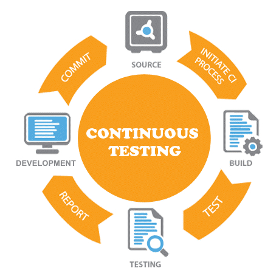

# Presentation

## Collaboration

Collaboration is the key to building successful testing. It involves having dedicated plans for what to test, how to share test results, monitor status, and share the knowledge across teams. Some of the key factors are:

### Collaborative test planning and review

- Shared understanding of requirements: Promote communication between devs and QA to know what needs to be tested
- Plan and design discussion to create test cases aligned with project goals and user stories.
  - Some may need to focus on E2E and interaction, plus visual regression. Especially, if it's involved with ArcGIS Maps SDK for Javascript, visual regression testing may also be very important.
- PR Reviews. Encourage testers to review PRs or at least check for updated tests. Devs can also review test steps to ensure coverage is accurate.

### Dedicated Teams channel for testing

- Create an internal channel (Slack, Teams, etc.) or user group dedicated to testing practices.
- Encourage open communication, share successful stories, knowledge sharing, e.g. solutions to map rendering or performance issues.

### Test visibility across pipelines and regression validation

- (Talk about where tests are chipped in. )
- The PR changed codes must be validated that the regression tests are all successful.
- Shared build pipelines: Everyone can see the status of tests in real-time (pass/fail) on each commit. This includes unit, integration, and end-to-end tests for ArcGIS-based features.

### Keeping code owners informed on test results

- Automated notification. If a test fails, relevant team members (devs or QA) get notified to resolve issues quickly. (Codeowners + PR Comments)

### Documentation and sharing best practices

- internal documentation: keep a section on how to set up local environments for testing, e.g. hwo to run mocks for ArcGIS services, and guidelines for E2E tests

## Automation

> TODO: Add some text in the Automation slide

Here's the common process when it comes to continuous integration and continuous deployment.

1. Initially, we pull the latest code from the dedicated branch using some sort of source code management, like Git or SVN (apache subversion).
2. We then build the application. This may involve setting up
   - dedicated environment. If you are using node, you will need nodejs and npm. If you are using java, you will need maven.
   - Install required dependencies.
   - And go through build process if there is any. Involve some minification, files mapping, tree shaking or some sort.
3. After it's build, you the run testing, this may cover all aspects such as unit testing, integration testing, end-to-end testing or others.
   - This may involve using testing frameworks like playwrights, selenium, vitest, or of your choice.
   - This step may include things like notifying the dedicated QA, or developers, writing out emails for test results, and so on.
4. For the last, we have deployment. This may be a dockerized container, or simply copy and pasting files, or directly hosting them on the machine itself.

### Demo

## Continuous Testing

Continuous Testing is a software testing practice where automated tests are executed at every stage of the software development lifecycle. The primary goal is to identify defects early, maintain high software quality, and provide prompt feedback to developers—ensuring that changes do not introduce regressions.

The diagram as you see is similar to the previous CI/CD pipeline, but the key idea is testing occurs at every stage of the software development life cycle. Good example where this can be implemented is within pull request, where automated tests validate the branch as soon as a commit is pushed. This helps detect issues before they reach production, reducing the cost and effort of fixing defects later.

At the end of the workflow, it should inform the author of the test results, ensuring the changes wouldn't cause regression. This proactive approach enables fast iteration, reliable code changes, and a stable release pipeline.

#### Demo on Continuous testing

We will dive into the actual code

---

Here's the demo on our example.

Reference: https://www.techtarget.com/searchsoftwarequality/CI-CD-pipelines-explained-Everything-you-need-to-know

Source

- Git, Cloudsmith

Install + Build

- Java: Maven
- Node.js: npm + build commands, vite build plugin

Test

- Selenium
- Vitest, Playwright, and many other

Deploy

- AWS
