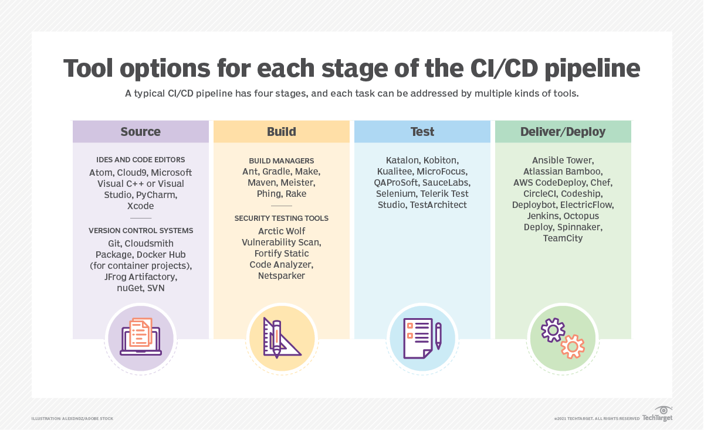

# Presentation

## Collaboration

- Codeowners
- Notify Teams Channel
- Report Emails
- Through PR comments

### Design testing

- Shared understanding of requirements: Encourage regular communication so both devs and QA know exactly what needs to be tested
- Planning and design discussion to create test cases aligned with project goals and user stories. Some may need to focus on E2E and interaction, plus visual regression. Especially ArcGIS map components may require a lot of visual related testings.
- Pull Request (PR) Reviews: Encourage testers to review PRs or at least check for updated tests. Devs can also review test steps to ensure coverage is accurate.

### Internal channel

- Create an internal channel (Slack, Teams, etc.) or user group dedicated to ArcGIS testing practices.
- Encourage open communication, code snippets, solutions to map rendering or performance issues, and success stories.

### Regression Testing on PRs

- The PR changed codes must be validated that the regression tests are all successful.
- Shared build pipelines: Everyone can see the status of tests in real-time (pass/fail) on each commit. This includes unit, integration, and end-to-end tests for ArcGIS-based features.
- Automated alerts: If a test fails, relevant team members (devs or QA) get notified to resolve issues quickly. (Codeowners + PR Comments)

### Documentation and best practices

- internal documentation: keep a section on how to set up local environments for testing, hwo to run mocks for ArcGIS services, and guidelines for E2E tests

### PR Checks

## Automation

What's the common release process.

Reference: https://www.techtarget.com/searchsoftwarequality/CI-CD-pipelines-explained-Everything-you-need-to-know

Source

- Git, Cloudsmith

Install + Build

- Java: Maven
- Node.js: npm + build commands, vite build plugin

Test

- Selenium
- Vitest, Playwright, and many other

Deploy

- AWS
